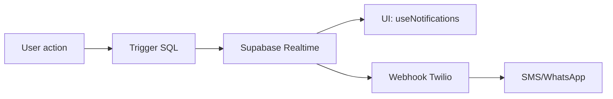

# Notifications Temps Réel (Supabase Realtime & Twilio)

---

# Notifications temps réel

## Missions : Respect strict des préférences utilisateur

## Page Paramètres de notification
La route `/settings/notifications` permet à chaque utilisateur de gérer en autonomie ses canaux de notification (Email, SMS, WhatsApp, in-app). La page s’appuie sur le hook `useNotificationPreferences` (chargement/édition), le service Supabase (CRUD), et applique les règles RLS. Les modifications sont propagées en temps réel à l’ensemble des modules de notification.

Avant tout envoi de notification de création ou de mise à jour de mission (canal WhatsApp), la préférence utilisateur est systématiquement vérifiée via `checkNotificationPreference`. Si la préférence est désactivée, aucun envoi n’est effectué et un log d’audit avec status `preference_skipped` et reason explicite (`user_disabled_whatsapp_notifications`) est enregistré dans `notification_logs`. Ce mécanisme garantit le respect strict des préférences et la traçabilité de chaque tentative d’envoi.


## Respect des préférences utilisateur lors du fallback (retry)

Depuis la version IA-FIRST 2025, **toute tentative de relance (retry/fallback) d'une notification respecte strictement les préférences utilisateur**.

- Avant d'envoyer une notification de fallback (SMS ou email), le système vérifie la préférence via `checkNotificationPreference(userId, canal)`.
- **Si le canal est désactivé pour l'utilisateur, aucun envoi n'est effectué.**
- Cette décision est **journalisée pour audit** dans la table `notification_logs` avec le statut `not_sent_pref_disabled` et un message d'audit explicite.

Exemple de log :
```
status: not_sent_pref_disabled
audit_message: Canal sms désactivé, renvoi annulé.
```

Cela garantit la conformité RGPD et le respect de la volonté de l'utilisateur, même en cas de fallback automatique.

---

## Fallback notifications

Les préférences utilisateur sont systématiquement vérifiées avant tout envoi, qu'il s'agisse d'une notification initiale, d'un fallback ou d'une relance automatique.

Les préférences utilisateur sont consultées via la fonction `checkNotificationPreference` avant toute tentative de renvoi.

Pour plus de détails techniques, voir la fonction `fallbackNotification` dans `notificationRetryService.ts`.

✅ Script `notify:deploy` automatisé :
- Migration SQL via `psql`
- Tests unitaires (`npm run test`)
- Tests E2E Cypress ciblés (`cypress/e2e/notifications.spec.ts`)
- Vérification automatisée post-déploiement (`scripts/notify-verify.cjs`)

📌 Tests intégrés :
- Unitaires : couverture du hook, service, handler
- E2E : badge, toast, lecture, suppression

🔐 Migration SQL automatisée :
- Table `notifications` : trigger + RLS
- Exécutée automatiquement à chaque déploiement

---

## Architecture



## Sécurité
- RLS sur la table notifications : seuls les destinataires voient leurs messages.
- Webhook Twilio : signature vérifiée, logs en base.

### Variables d'environnement Twilio
- `TWILIO_WHATSAPP_FROM` : numéro WhatsApp (format `whatsapp:+XYZ`)
- `TWILIO_SMS_FROM` : numéro SMS (format `+XYZ`)

### Sécurité Webhook Twilio
Le endpoint `/api/webhooks/twilio` applique les contrôles suivants :
- **Content-Type strict** : seuls `application/json` et `application/x-www-form-urlencoded` sont acceptés. Rejet (415) sinon.
- **Signature Twilio** : chaque requête POST doit être signée (header `x-twilio-signature`). Signature invalide = rejet (403), loggué.
- **Rate limiting** : 60 requêtes/min/IP (429 si dépassé).
- **Validation Zod** : payload validé par schéma Zod strict. Erreur = rejet (400).
- **Anti-replay** : chaque `MessageSid` Twilio est vérifié (doublon = 409, loggué).
- **Gestion des erreurs** : chaque rejet a un code HTTP explicite et message JSON clair.
- **Logging** : chaque événement (succès, rejet, erreur) est enregistré dans `notification_logs` pour audit.

## Endpoints
- `POST /api/webhooks/twilio` : réception événements Twilio

## Stratégies
- Fallback email si SMS échoue
- Badge de build CI “notifications ✅”

## Logs
- Table notification_logs pour traçabilité

## Tests
- Cypress : badge, toast, lecture, suppression
- Unitaires : hook, service, handler
