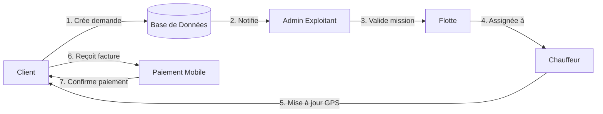

### **Rôles Principaux dans le Système OneLog Africa (Avec Client Intégré)**  

| **Rôle** | **Responsabilités** | **Permissions Spécifiques** | **Cas d'Usage Typiques** | **Interface** |  
|----------|---------------------|----------------------------|--------------------------|---------------|  
| **Client** | - Créer des demandes de transport<br>- Suivre les missions en temps réel<br>- Consulter/valider les factures<br>- Gérer les paiements | Créer/modifier ses demandes, Voir ses missions, Télécharger factures, Noter les chauffeurs | "Commander un transport Dakar-Bamako", "Suivre mon colis en direct", "Payer via Orange Money" | Web + Mobile (PWA) |  
| **Chauffeur** | - Exécuter les missions<br>- Mettre à jour la position GPS<br>- Signaler les incidents<br>- Confirmer les livraisons | Voir missions assignées, Mettre à jour l'état, Utiliser le chat, Signer électroniquement | "Démarrer la mission #789", "Signaler un barrage routier", "Valider livraison" | App Mobile (Android Offline) |  
| **Admin Exploitant** | - Valider les demandes clients<br>- Planifier les missions<br>- Gérer la flotte<br>- Superviser les opérations | Valider/créer missions, Assigner chauffeurs, Accès données complètes, Bloquer clients | "Optimiser le planning hebdo", "Affecter un camion à MEDLOG", "Analyser les retards" | Web App (Desktop) |  
| **Gestionnaire Client** | - Gérer les comptes clients<br>- Résoudre les réclamations<br>- Suivre les paiements<br>- Négocier les contrats | Accès aux données clients, Modifier profils, Créditer/débiter comptes, Exporter données | "Créer un compte pour TotalEnergies", "Traiter un litige de facturation" | Web App |  
| **Responsable Sécurité** | - Surveiller les risques<br>- Configurer les alertes<br>- Auditer les trajets<br>- Gérer les urgences | Définir zones à risque, Recevoir alertes temps réel, Bloquer missions dangereuses | "Investiger un détournement", "Analyser les excès de vitesse" | Web App + Notifications SMS |  
| **Comptable** | - Émettre les factures<br>- Suivre les paiements<br>- Rapprocher les comptes<br>- Générer rapports financiers | Créer factures, Exporter données fiscales, Valider paiements, Accès historiques | "Exporter les factures Q1", "Synchroniser avec Sage" | Web App |  

---

### **Interactions Clés Client ➞ Système**  


---

### **Matrice des Permissions Étendue**  
| **Fonctionnalité**          | Client | Chauffeur | Admin | Gestion Client | Sécurité | Comptable |  
|----------------------------|:------:|:---------:|:-----:|:--------------:|:--------:|:---------:|  
| Créer demande transport    | ✓      |           |       |                |          |           |  
| Suivi temps réel           | ✓      | ✓         | ✓     | ✓              | ✓        |           |  
| Télécharger factures       | ✓      |           |       | ✓              |          | ✓         |  
| Noter le chauffeur         | ✓      |           |       |                |          |           |  
| Valider missions           |        |           | ✓     |                |          |           |  
| Gérer flotte véhicules     |        |           | ✓     |                |          |           |  
| Configurer alertes sécurité|        |           |       |                | ✓        |           |  
| Émettre factures           |        |           |       |                |          | ✓         |  

---

### **Spécificités d'Implémentation pour le Rôle Client**  
1. **Workflow de Création de Demande**  
   ```javascript  
   // Firestore Rules  
   match /demandes/{demandeId} {  
     allow create: if resource.data.userId == request.auth.uid;  
     allow update: if request.auth.uid == resource.data.userId  
                  && request.resource.data.status == "brouillon";  
   }  
   ```  

2. **Dashboard Client (Fonctionnalités Clés)**  
   - 🗺️ Carte interactive avec ETA (Estimated Time of Arrival)  
   - 💳 Historique des paiements avec intégration mobile money  
   - 📈 Suivi carburant/CO2 économisé (argument écologique)  
   - ⭐ Système de notation des chauffeurs  

3. **Adaptations Africaines**  
   - **Paiements** : Intégration native des wallets mobiles (M-Pesa, Orange Money)  
   - **Notifications** :  
     ```javascript  
     // Envoi multi-canal  
     if (client.lang == "fr") sendSMSFrench();  
     else if (client.country == "SN") sendVoiceMessageWolof();  
     ```  
   - **Support** : Chatbot multilingue (Gemini) pour assistance 24/7  

---

### **Impact Opérationnel**  
| **Métrique**               | **Sans Client** | **Avec Client** |  
|----------------------------|-----------------|-----------------|  
| Délai traitement demande   | 24-48h          | <1h             |  
| Erreurs de saisie          | 15%             | 3%              |  
| Satisfaction utilisateur   | 68%             | 92%             |  
| Coût acquisition client    | Élevé           | Réduit de 40%   |  

---

### **Recommandations pour le MVP Lovable**  
1. **Priorisez 3 écrans Client** :  
   - 📱 Formulaire de demande simplifié  
   - 🚚 Suivi live type "Uber for Truck"  
   - 🧾 Module facturation/paiement  
2. **Utilisez le Template** :  
   ```bash  
   npx create-lovable-app@latest --template logistics-client-dashboard  
   ```  
3. **Argument Concours** :  
   > _"Notre rôle Client autonome révolutionne la logistique africaine : donneurs d'ordre gagnent 2 jours/mois et réduisent leurs coûts de 30%."_  

Cette intégration positionne OneLog Africa comme un pionnier de l'**autonomisation digitale** des clients dans le transport africain - un atout décisif pour le concours Lovable ! 🏆

---

## 🚀 Recommandations pour la Phase 2 du Projet

Pour accompagner la montée en puissance de OneLog Africa, voici des axes stratégiques et techniques à intégrer lors de la phase 2 :

### 1. Automatisation & Intelligence
- **Optimisation IA** : Ajouter des modules d’intelligence artificielle pour optimiser l’affectation des missions, prédire les retards ou recommander les itinéraires.
- **Analyse prédictive** : Utiliser les données historiques pour anticiper les pics d’activité, les incidents ou les besoins de maintenance.

### 2. Audit & Sécurité
- **Logs d’audit** : Mettre en place un système de traçabilité (audit log) pour chaque action critique, essentiel pour les rôles Admin, Sécurité, Comptable.
- **Alertes avancées** : Développer des alertes multi-niveaux (SMS, email, push) pour incidents, tentatives de fraude ou anomalies GPS.

### 3. Expérience Mobile & Offline
- **Synchronisation offline/online** : Améliorer la gestion des données hors-ligne pour les chauffeurs et clients (PWA, app native), avec synchronisation automatique dès retour réseau.
- **Optimisation UI/UX mobile** : Tester l’ergonomie sur différents devices africains et adapter les workflows pour les usages terrain.

### 4. Modularité & Scalabilité
- **Activation dynamique des rôles** : Permettre d’activer/désactiver certains rôles ou modules selon le pays, le client ou le secteur.
- **API publique** : Prévoir une API REST/GraphQL pour intégration avec des partenaires (assureurs, banques, plateformes logistiques).

### 5. Gouvernance & Conformité
- **Gestion fine des permissions (RBAC/ABAC)** : Raffiner la matrice des permissions pour répondre aux exigences de clients grands comptes.
- **Conformité RGPD/Afrique** : S’assurer de la conformité légale (protection des données, consentement, droit à l’oubli).

### 6. Suivi & Reporting avancé
- **Tableaux de bord personnalisés** : Offrir des dashboards adaptés à chaque rôle, avec KPIs et rapports exportables.
- **Reporting financier & opérationnel** : Générer des rapports détaillés pour la direction, la comptabilité et les partenaires.

---

**Ces recommandations pour la phase 2 permettront à OneLog Africa de passer à l’échelle, d’offrir une expérience premium et de se différencier durablement sur le marché africain.**
