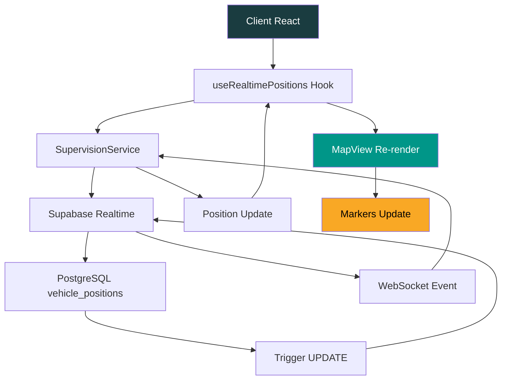

# Supervision MVP - Spécifications Techniques
## Phase 1 - Map-First MVP avec UI System

### 📋 Vue d'ensemble

Le **Supervision MVP** est la première phase de développement du système de supervision temps réel de OneLog Africa. Il implémente une approche **Map-First** avec une carte interactive full-screen, des filtres avancés et une connexion temps réel via Supabase.

### 🎯 Objectifs

- ✅ Supervision temps réel de la flotte de véhicules
- ✅ Interface utilisateur moderne avec palette OneLog Africa
- ✅ Filtres interactifs (statut, zone, conducteur)
- ✅ Connexion WebSocket pour mises à jour en temps réel
- ✅ Tests unitaires et E2E complets
- ✅ Performance optimisée (< 2s chargement, < 1s mise à jour)

---

## 🏗️ Architecture Technique

### Composants Principaux

```
src/
├── components/
│   ├── ui-system.tsx              # Système UI + palette couleurs
│   └── supervision/
│       ├── MapView.tsx            # Carte interactive full-screen
│       └── SidebarFilters.tsx     # Filtres avancés
├── services/
│   └── SupervisionService.ts      # Service connexion Supabase
├── hooks/
│   └── useRealtimePositions.ts    # Hook temps réel
└── __tests__/                     # Tests unitaires et E2E
```

### Stack Technique

- **Frontend**: React 18, TypeScript, Tailwind CSS
- **Backend**: Supabase (PostgreSQL + Realtime)
- **Tests**: Vitest (unitaires) + Cypress (E2E)
- **Fonts**: Montserrat (titres) + Open Sans (texte)
- **Icons**: Lucide React

---

## 🎨 UI System - Palette OneLog Africa

### Variables CSS

```css
:root {
  --onelog-primary: #1A3C40;    /* Bleu-vert foncé principal */
  --onelog-accent: #F9A825;     /* Jaune/orange accent */
  --onelog-secondary: #E65100;  /* Orange secondaire */
  --onelog-success: #009688;    /* Vert succès */
  --onelog-dark: #263238;       /* Gris foncé texte */
  --onelog-light: #F4F4F4;      /* Gris clair fond */
}
```

### Composants UI

```tsx
// Boutons avec variants
<ButtonVariants variant="primary|secondary|outline|ghost|success" size="sm|md|lg">
  Action
</ButtonVariants>

// Layout avec header
<Layout showHeader={true}>
  <YourContent />
</Layout>

// Cards et badges
<Card title="Titre">
  <Badge text="Statut" color="accent|secondary|success|neutral" />
</Card>
```

---

## 🗺️ MapView Component

### Fonctionnalités

- **Carte full-screen** avec mode plein écran
- **Markers temps réel** avec couleurs par statut
- **Popup d'information** véhicule au clic
- **Légende interactive** avec statuts
- **Indicateur de connexion** temps réel
- **Compteur de véhicules** filtré

### Props Interface

```tsx
interface MapViewProps {
  filters: {
    status: string[];
    zone: string[];
    driver: string[];
  };
  onMarkerClick?: (vehicle: VehiclePosition) => void;
  fullscreen?: boolean;
  onToggleFullscreen?: () => void;
}
```

### Couleurs des Markers

| Statut | Couleur | Hex Code |
|--------|---------|----------|
| Active | Vert | `#009688` |
| Idle | Jaune | `#F9A825` |
| Maintenance | Orange | `#E65100` |

---

## 🔧 SidebarFilters Component

### Sections de Filtres

1. **Statut des véhicules**
   - Actif, Inactif, Maintenance
   - Indicateurs visuels colorés

2. **Zones géographiques**
   - Dakar, Thiès, Kaolack, Saint-Louis
   - Filtrage par région

3. **Chauffeurs**
   - Liste des conducteurs actifs
   - Filtrage par nom

### Fonctionnalités

- **Filtres combinables** (AND logic)
- **Compteur de filtres actifs**
- **Bouton "Effacer tout"**
- **Mode réduit/étendu**
- **Badges de résumé** en mode réduit

---

## 🔌 API et Services

### SupervisionService

```typescript
class SupervisionService {
  // Récupération des positions
  async getPositions(): Promise<VehiclePosition[]>
  
  // Connexion temps réel
  connectRealtime(callback: (positions: VehiclePosition[]) => void): () => void
  
  // Données de développement
  getMockPositions(): VehiclePosition[]
  
  // Filtrage
  filterPositions(positions: VehiclePosition[], filters: SupervisionFilters): VehiclePosition[]
  
  // Statistiques
  getFleetStats(positions: VehiclePosition[]): FleetStats
}
```

### Endpoints API

```
GET /api/v2/supervision/positions
- Récupère toutes les positions actuelles
- Réponse: VehiclePosition[]

WebSocket /realtime/v1
- Canal: postgres_changes
- Table: vehicle_positions
- Events: INSERT, UPDATE, DELETE
```

### Interface VehiclePosition

```typescript
interface VehiclePosition {
  id: string;
  name: string;
  lat: number;
  lng: number;
  status: 'active' | 'idle' | 'maintenance';
  mission?: string;
  driver?: string;
  zone?: string;
  speed?: number;
  heading?: number;
  lastUpdate: string;
}
```

---

## 🔄 Flux de Données Temps Réel



---

## ⚡ Critères de Performance

### Temps de Chargement

| Métrique | Cible | Mesure |
|----------|-------|--------|
| **Chargement initial** | < 2s | Time to Interactive |
| **Mise à jour temps réel** | < 1s | WebSocket → Render |
| **Filtrage** | < 500ms | User Input → UI Update |
| **Mode plein écran** | < 300ms | Toggle Animation |

### Optimisations

- **Lazy loading** des composants non critiques
- **Memoization** des calculs de filtres
- **Debouncing** des mises à jour fréquentes
- **Virtual scrolling** pour grandes listes

---

## 🧪 Tests

### Tests Unitaires (Vitest)

```bash
# Lancer les tests unitaires
npm run test:unit

# Tests avec coverage
npm run test:coverage
```

**Couverture cible**: > 90%

### Tests E2E (Cypress)

```bash
# Lancer les tests E2E
npm run test:e2e

# Mode interactif
npm run cypress:open
```

**Scénarios testés**:
- Rendu de la carte et markers
- Fonctionnement des filtres
- Mises à jour temps réel
- Responsive design
- Accessibilité (WCAG 2.1)

---

## 🚀 Instructions d'Exécution

### Environnement Local

```bash
# 1. Installation des dépendances
npm install

# 2. Configuration Supabase
cp .env.example .env.local
# Remplir NEXT_PUBLIC_SUPABASE_URL et NEXT_PUBLIC_SUPABASE_ANON_KEY

# 3. Lancement du serveur de développement
npm run dev

# 4. Accès à la supervision
http://localhost:3000/supervision
```

### Mode Développement

- **Données mock** automatiquement utilisées
- **Simulation temps réel** toutes les 5 secondes
- **Hot reload** pour modifications UI

### Environnement Staging

```bash
# 1. Build de production
npm run build

# 2. Déploiement
npm run deploy:staging

# 3. Tests E2E sur staging
npm run test:e2e:staging
```

---

## 📊 Monitoring et Métriques

### Métriques Clés

- **Temps de réponse API** (< 500ms)
- **Taux de connexion WebSocket** (> 99%)
- **Erreurs JavaScript** (< 0.1%)
- **Performance Lighthouse** (> 90)

### Alertes

- **Déconnexion WebSocket** > 30s
- **Erreur API** > 5% sur 5min
- **Temps de chargement** > 3s

---

## 🔐 Sécurité

### Authentification

- **JWT tokens** via Supabase Auth
- **Row Level Security** (RLS) sur `vehicle_positions`
- **Permissions par rôle** (admin, operator, viewer)

### Validation

- **Input sanitization** côté client et serveur
- **Rate limiting** sur les endpoints API
- **CORS** configuré pour domaines autorisés

---

## 🚢 Déploiement

### Pipeline CI/CD

```yaml
# .github/workflows/supervision-mvp.yml
name: Supervision MVP Deploy

on:
  push:
    branches: [feat/supervision-mvp]

jobs:
  test:
    runs-on: ubuntu-latest
    steps:
      - uses: actions/checkout@v3
      - name: Run tests
        run: |
          npm ci
          npm run test:unit
          npm run test:e2e:headless
  
  deploy:
    needs: test
    runs-on: ubuntu-latest
    steps:
      - name: Deploy to staging
        run: npm run deploy:staging
```

### Rollback Plan

1. **Monitoring** des métriques post-déploiement
2. **Rollback automatique** si erreurs > seuil
3. **Backup** de la version précédente
4. **Tests de régression** automatiques

---

## 📈 Prochaines Étapes

### Phase 2 - Cards Dashboard

- Dashboard modulaire avec cartes synthétiques
- Widgets configurables
- Alertes et notifications

### Phase 3 - Facturation Avancée

- Facturation multi-acteurs
- Gestion des tiers
- Rapports automatisés

### Phase 4 - Notifications Contrôlables

- Notifications client personnalisables
- Templates configurables
- Canaux multiples (SMS, email, push)

---

## 🤝 Contribution

### Standards de Code

- **ESLint** + **Prettier** pour le formatage
- **TypeScript strict** mode
- **Conventional Commits** pour les messages
- **Tests obligatoires** pour nouvelles fonctionnalités

### Pull Request

```bash
# Créer la branche
git checkout -b feat/supervision-mvp

# Commits
git commit -m "feat(supervision): add MapView component"
git commit -m "feat(supervision): add SidebarFilters component"
git commit -m "test(supervision): add unit and E2E tests"
git commit -m "docs(supervision): add technical specifications"

# Push et PR
git push origin feat/supervision-mvp
# Créer PR: "feat(supervision-mvp): Map-First MVP with UI system"
```

---

**Version**: 1.0.0  
**Date**: 2025-01-17  
**Auteur**: OneLog Africa Dev Team  
**Status**: ✅ Ready for Review
