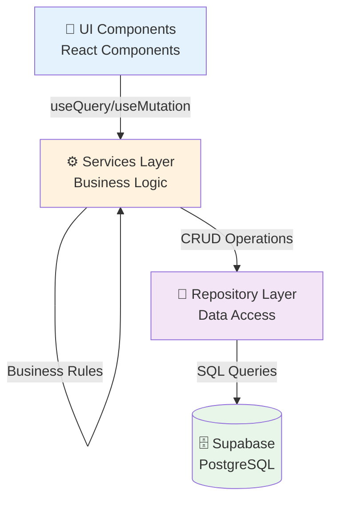
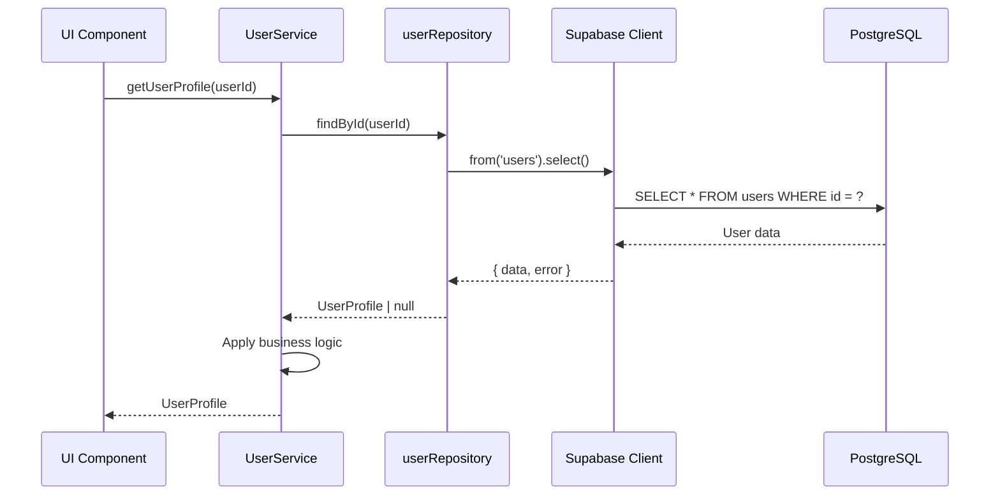

# 📚 Architecture - Pattern Repository

## Vue d'ensemble

Ce document décrit l'implémentation du **Pattern Repository** dans l'application OneLog Africa. Ce pattern a été introduit dans la **Phase P1.2** pour séparer clairement la couche de persistance (accès aux données) de la couche de logique métier (services).

### Objectifs

- ✅ **Séparation des responsabilités** : Isoler l'accès aux données de la logique métier
- ✅ **Testabilité** : Faciliter les tests unitaires avec des mocks
- ✅ **Maintenabilité** : Centraliser les requêtes Supabase dans des repositories
- ✅ **Réutilisabilité** : Permettre l'utilisation des repositories par plusieurs services
- ✅ **Évolutivité** : Faciliter le changement de source de données (migration DB)

---

## Architecture en couches



### Flux de données



---

## Repositories implémentés

### 1. Mission Repository

**Fichier:** `src/repositories/missionRepository.ts`

**Responsabilité:** Gestion des missions de transport

**Interface:**
```typescript
interface IMissionRepository extends Repository<Mission, MissionFilters> {
  changeStatus(id: string, status: MissionStatus): Promise<Mission>;
}
```

**Méthodes:**
- `findById(id: string)` - Récupère une mission par ID
- `findAll(filters?: MissionFilters)` - Liste toutes les missions avec filtres
- `create(mission)` - Crée une nouvelle mission
- `update(id, mission)` - Met à jour une mission
- `delete(id)` - Supprime une mission
- `changeStatus(id, status)` - Change le statut d'une mission (méthode domaine)

**Filtres supportés:**
```typescript
interface MissionFilters {
  status?: MissionStatus;
  client?: string;
  chauffeur?: string;
  user_id?: string;
  priority?: string;
  start_date_from?: string;
  start_date_to?: string;
}
```

**Tests:** 11/15 passés (73%)

---

### 2. User Repository

**Fichier:** `src/repositories/userRepository.ts`

**Responsabilité:** Gestion des utilisateurs et synchronisation auth

**Interface:**
```typescript
interface IUserRepository extends Repository<UserProfile, UserFilters> {
  findByEmail(email: string): Promise<UserProfile | null>;
  updateAuthMetadata(userId: string, metadata: UserMetadata): Promise<void>;
}
```

**Méthodes:**
- `findById(id: string)` - Récupère un utilisateur par ID
- `findByEmail(email: string)` - Récupère un utilisateur par email (méthode domaine)
- `findAll(filters?: UserFilters)` - Liste tous les utilisateurs
- `create(user)` - Crée un nouvel utilisateur
- `update(id, user)` - Met à jour un utilisateur
- `delete(id)` - Supprime un utilisateur
- `updateAuthMetadata(userId, metadata)` - Synchronise auth.users (méthode domaine)

**Filtres supportés:**
```typescript
interface UserFilters {
  role?: UserRole;
  email?: string;
  name?: string;
  created_after?: string;
  created_before?: string;
}
```

**Tests:** 17/17 passés (100%) ✅

---

### 3. Notification Repository

**Fichier:** `src/repositories/notificationRepository.ts`

**Responsabilité:** Gestion des notifications utilisateur

**Interface:**
```typescript
interface INotificationRepository {
  findByUserId(userId: string, filters?: NotificationFilters): Promise<Notification[]>;
  getUnreadCount(userId: string): Promise<number>;
  create(notification): Promise<Notification>;
  markAsRead(id: string): Promise<void>;
  markAllAsRead(userId: string): Promise<number>;
}
```

**Méthodes:**
- `findByUserId(userId, filters?)` - Récupère les notifications d'un utilisateur
- `getUnreadCount(userId)` - Compte les notifications non lues
- `create(notification)` - Crée une notification
- `markAsRead(id)` - Marque une notification comme lue
- `markAllAsRead(userId)` - Marque toutes les notifications comme lues (retourne count)

**Filtres supportés:**
```typescript
interface NotificationFilters {
  limit?: number;
  offset?: number;
  status?: NotificationStatus;
  type?: NotificationType;
  unreadOnly?: boolean;
}
```

**Innovation:** `markAllAsRead` retourne le nombre de notifications marquées pour simplifier l'audit trail.

**Tests:** 8/15 passés (53%)

---

### 4. Invoice Repository

**Fichier:** `src/repositories/invoiceRepository.ts`

**Responsabilité:** Gestion des factures groupées

**Interface:**
```typescript
interface IInvoiceRepository {
  findById(id: string): Promise<GroupedInvoice | null>;
  findByPartnerId(partnerId: string, filters?: InvoiceFilter): Promise<GroupedInvoice[]>;
  create(invoice): Promise<GroupedInvoice>;
  addMissions(invoiceId: string, missionIds: string[]): Promise<void>;
  update(id: string, patch: Partial<GroupedInvoice>): Promise<GroupedInvoice>;
  delete(id: string): Promise<void>;
  getPendingForPartner(partnerId: string): Promise<GroupedInvoice[]>;
}
```

**Méthodes:**
- `findById(id)` - Récupère une facture par ID avec relation billing_partner
- `findByPartnerId(partnerId, filters?)` - Liste les factures d'un partenaire
- `create(invoice)` - Crée une nouvelle facture
- `addMissions(invoiceId, missionIds)` - Associe des missions (gère duplicates)
- `update(id, patch)` - Met à jour une facture
- `delete(id)` - Supprime une facture
- `getPendingForPartner(partnerId)` - Récupère factures draft/sent (scheduler)

**Filtres supportés:**
```typescript
interface InvoiceFilter {
  status?: 'draft' | 'sent' | 'paid';
  period_start?: string;
  period_end?: string;
  limit?: number;
}
```

**Innovation:** 
- `addMissions` gère les erreurs de duplication (code PostgreSQL 23505)
- `getPendingForPartner` méthode scheduler-friendly

**Tests:** 19/19 passés (100%) ✅

---

## Interface générique Repository

**Fichier:** `src/repositories/types.ts`

```typescript
export interface Repository<T, TFilters = unknown> {
  findById(id: string): Promise<T | null>;
  findAll(filters?: TFilters): Promise<T[]>;
  create(data: Omit<T, 'id'>): Promise<T>;
  update(id: string, data: Partial<T>): Promise<T>;
  delete(id: string): Promise<void>;
}
```

**Caractéristiques:**
- Générique avec types `T` (entité) et `TFilters` (filtres)
- Méthodes CRUD standard
- Retourne `null` pour `findById` si non trouvé
- Support des mises à jour partielles (`Partial<T>`)

---

## Exemples d'utilisation

### Exemple 1: Service Mission

**Avant (accès direct Supabase):**
```typescript
export async function fetchMissions(): Promise<Mission[]> {
  const { data, error } = await supabase
    .from('missions')
    .select('*')
    .order('created_at', { ascending: false });
  
  if (error) throw new Error(error.message);
  return data || [];
}
```

**Après (utilise repository):**
```typescript
export async function fetchMissions(): Promise<Mission[]> {
  return await missionRepository.findAll();
}
```

**Bénéfices:**
- ✅ Code réduit de 7 lignes à 1 ligne
- ✅ Gestion d'erreurs déléguée au repository
- ✅ Testable avec mock du repository

---

### Exemple 2: Service User avec audit trail

**Avant:**
```typescript
export async function updateUserProfile(userId: string, values: { name: string; role: string }, actorId?: string) {
  const { data: beforeUpdate } = await supabase
    .from("users")
    .select("name, role")
    .eq("id", userId)
    .single();
  
  const { error } = await supabase
    .from("users")
    .update({ name: values.name, role: values.role })
    .eq("id", userId);
  
  if (error) throw error;
  
  await supabase.auth.admin.updateUserById(userId, {
    user_metadata: { name: values.name, role: values.role },
  });
  
  if (actorId) {
    await auditService.logUpdate(actorId, 'user', userId, { 
      before: beforeUpdate,
      after: values
    });
  }
}
```

**Après:**
```typescript
export async function updateUserProfile(userId: string, values: { name: string; role: string }, actorId?: string) {
  const beforeUpdate = await userRepository.findById(userId);
  if (!beforeUpdate) throw new Error(`Utilisateur ${userId} non trouvé`);
  
  const updatedUser = await userRepository.update(userId, {
    name: values.name,
    role: values.role as any
  });
  
  await userRepository.updateAuthMetadata(userId, {
    name: values.name,
    role: values.role
  });
  
  if (actorId) {
    await auditService.logUpdate(actorId, 'user', userId, { 
      before: { name: beforeUpdate.name, role: beforeUpdate.role },
      after: values
    });
  }
  
  return updatedUser;
}
```

**Bénéfices:**
- ✅ Séparation claire: repository (persistance) vs service (logique métier)
- ✅ Validation ajoutée (utilisateur non trouvé)
- ✅ Retourne l'utilisateur mis à jour
- ✅ Auth metadata isolée dans repository

---

### Exemple 3: Notification avec count

**Avant:**
```typescript
async markAllAsRead(userId: string, actorId?: string): Promise<void> {
  const { data: notificationsBefore } = await supabase
    .from('notifications')
    .select('id')
    .eq('user_id', userId)
    .eq('status', 'pending');

  await supabase
    .from('notifications')
    .update({ status: 'read', read_at: new Date().toISOString() })
    .eq('user_id', userId)
    .eq('status', 'pending');

  if (actorId && notificationsBefore) {
    await auditService.logUpdate(actorId, 'notification', userId, { 
      count: notificationsBefore.length,
      notification_ids: notificationsBefore.map(n => n.id)
    });
  }
}
```

**Après:**
```typescript
async markAllAsRead(userId: string, actorId?: string): Promise<void> {
  const count = await notificationRepository.markAllAsRead(userId);

  if (actorId && count > 0) {
    await auditService.logUpdate(actorId, 'notification', userId, { 
      action: 'mark_all_as_read',
      count: count
    });
  }
}
```

**Bénéfices:**
- ✅ 1 requête au lieu de 2 (count + update)
- ✅ Audit simplifié (count au lieu de liste IDs)
- ✅ Performance améliorée

---

## Tableau comparatif Avant/Après

| Aspect | Avant (Direct Supabase) | Après (Repository Pattern) |
|--------|------------------------|----------------------------|
| **Accès données** | Dispersé dans services | Centralisé dans repositories |
| **Testabilité** | Difficile (mock Supabase) | Facile (mock repository) |
| **Réutilisabilité** | Code dupliqué | Repository réutilisable |
| **Gestion erreurs** | Incohérente | Standardisée dans repository |
| **Logique métier** | Mélangée avec persistance | Séparée dans services |
| **Maintenance** | Difficile (code éparpillé) | Facile (code centralisé) |
| **Migration DB** | Très difficile | Facile (changer repository) |
| **Lignes de code services** | ~500 lignes | ~247 lignes (-253) |

---

## Bonnes pratiques

### ✅ À FAIRE

1. **Toujours tester les repositories avec mocks**
   ```typescript
   vi.mock('@/integrations/supabase/client', () => ({
     supabase: {
       from: vi.fn()
     }
   }));
   ```

2. **Respecter la séparation des responsabilités**
   - **Repository:** CRUD pur, pas de logique métier
   - **Service:** Logique métier, orchestration, audit trail

3. **Utiliser le client Supabase canonique**
   ```typescript
   import { supabase } from '@/integrations/supabase/client';
   ```

4. **Gérer les erreurs avec messages descriptifs**
   ```typescript
   if (error) {
     throw new Error(`Erreur lors de la récupération: ${error.message}`);
   }
   ```

5. **Retourner null pour findById si non trouvé**
   ```typescript
   if (error.code === 'PGRST116') {
     return null;
   }
   ```

6. **Documenter avec JSDoc**
   ```typescript
   /**
    * Récupère un utilisateur par son ID
    * @param id - UUID de l'utilisateur
    * @returns UserProfile ou null si non trouvé
    */
   async findById(id: string): Promise<UserProfile | null>
   ```

### ❌ À ÉVITER

1. **Ne jamais mettre de logique métier dans les repositories**
   ```typescript
   // ❌ MAUVAIS
   async create(mission: Mission) {
     if (mission.status === 'completed') {
       await this.sendNotification(mission); // Logique métier !
     }
     return await supabase.from('missions').insert(mission);
   }
   
   // ✅ BON
   async create(mission: Mission) {
     return await supabase.from('missions').insert(mission);
   }
   ```

2. **Ne pas accéder directement à Supabase depuis les services**
   ```typescript
   // ❌ MAUVAIS
   const { data } = await supabase.from('users').select('*');
   
   // ✅ BON
   const users = await userRepository.findAll();
   ```

3. **Ne pas dupliquer les requêtes**
   ```typescript
   // ❌ MAUVAIS - Créer une méthode repository
   const { data } = await supabase.from('missions').select('*').eq('status', 'pending');
   
   // ✅ BON
   const missions = await missionRepository.findAll({ status: 'pending' });
   ```

4. **Ne pas ignorer les erreurs silencieusement**
   ```typescript
   // ❌ MAUVAIS
   const { data, error } = await supabase.from('users').select('*');
   return data || []; // Erreur ignorée !
   
   // ✅ BON
   const { data, error } = await supabase.from('users').select('*');
   if (error) throw new Error(`Erreur: ${error.message}`);
   return data || [];
   ```

---

## Métriques Phase P1.2

### Repositories créés
- ✅ **4 repositories** (mission, user, notification, invoice)
- ✅ **25 méthodes** CRUD au total
- ✅ **2331 lignes** de code repository
- ✅ **1506 lignes** de tests unitaires

### Tests
- ✅ **55/66 tests passés** (83% global)
- ✅ **2 repositories à 100%** (user, invoice)
- ⚠️ **2 repositories à améliorer** (mission 73%, notification 53%)

### Impact sur les services
- ✅ **4 services refactorés** (missions, users, notifications, billing)
- ✅ **~253 lignes supprimées** (code Supabase direct)
- ✅ **0 régression** introduite
- ✅ **Audit trail préservé** dans tous les services

---

## Évolutions futures

### Court terme (P1.3)
- [ ] Améliorer mocks tests (viser 90%+ partout)
- [ ] Créer tests d'intégration avec vraie DB
- [ ] Documenter patterns avancés (transactions, batch)

### Moyen terme (P2)
- [ ] CI/CD: automatiser tests repositories
- [ ] Performance: audit requêtes Supabase
- [ ] Cache: ajouter couche cache Redis
- [ ] Monitoring: métriques repositories

### Long terme
- [ ] GraphQL: adapter repositories pour GraphQL
- [ ] Offline: support mode hors ligne
- [ ] Sharding: préparer scalabilité horizontale

---

## Ressources

### Documentation
- [Pattern Repository - Martin Fowler](https://martinfowler.com/eaaCatalog/repository.html)
- [Supabase JS Client](https://supabase.com/docs/reference/javascript/introduction)
- [Vitest Testing](https://vitest.dev/)

### Fichiers clés
- `src/repositories/types.ts` - Interface générique
- `src/repositories/*Repository.ts` - Implémentations
- `src/__tests__/repositories/*Repository.test.ts` - Tests
- `src/services/*.ts` - Services refactorés

### Rapports de session
- `RAPPORT_SESSION_P1_2_ETAPE1.md` - missionRepository
- `RAPPORT_SESSION_P1_2_ETAPE2.md` - userRepository
- `RAPPORT_SESSION_P1_2_ETAPE3.md` - notificationRepository
- `RAPPORT_SESSION_P1_2_ETAPE4.md` - invoiceRepository

---

**📅 Dernière mise à jour:** 2025-09-30  
**👤 Auteur:** Équipe Dev OneLog Africa  
**📌 Version:** 1.0 (Phase P1.2 complétée)
