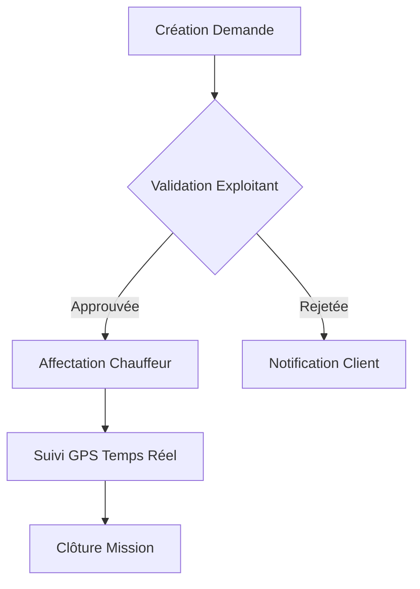

# 📘 Guide Utilisateur Transporteur - OneLog Africa

*Dernière mise à jour: 09/09/2024*

## 🎯 Public Cible
Exploitants • Administrateurs • Chauffeurs

## 📚 Table des Matières
1. 🔐 Connexion & Authentification
2. 📊 Utilisation du Dashboard TV
3. 🚚 Gestion des Missions
4. 📍 Suivi GPS Temps Réel
5. 💌 Gestion des Notifications
6. 🧾 Téléchargement des Factures
7. ⚙️ Profil et Paramètres

---

### 1. 🔐 Connexion & Authentification

**Accès à la plateforme :**
1. Ouvrir https://app.onelogafrica.com
2. Saisir vos identifiants fournis par votre administrateur
3. Choisir votre rôle : Exploitant ou Chauffeur

### 2. 📊 Dashboard TV (Mode Grand Écran)

**Fonctionnalités clés :**
- Bouton plein écran en haut à droite
- Filtres dynamiques (statut, client, véhicule)
- Vue synthétique des missions en cours
- Raccourcis clavier : 
  - `F11` Plein écran 
  - `F` Afficher/masquer filtres

### 3. 🚚 Gestion des Missions

**Workflow typique :**

### 4. 📍 Suivi GPS Temps Réel

- Carte interactive avec positions des chauffeurs
- Historique des trajets
- Alertes déviation d'itinéraire
- Mode hors-ligne disponible

### 5. 💌 Notifications

**Personnalisation :**
1. Accéder à Paramètres > Notifications
2. Choisir canaux : Email/SMS/WhatsApp
3. Définir règles par type d'événement
4. Activer/désactiver par mission

### 6. 🧾 Facturation

**Téléchargement :**
1. Menu > Facturation
2. Sélectionner période
3. Bouton "Exporter PDF"
4. Reçus disponibles 24h/24

### 7. ⚙️ Profil et Paramètres

- Mettre à jour numéro de téléphone
- Changer mot de passe
- Configurer préférences de langue
- Gérer les appareils connectés

---

## 🆘 Support Technique
Contactez notre équipe :
- 📞 +225 20 00 00 00
- ✉️ support@onelogafrica.com
- 🕒 24h/24 - 7j/7

> ℹ️ Guide complet à venir : Documentation détaillée avec captures d'écran et workflows complets
