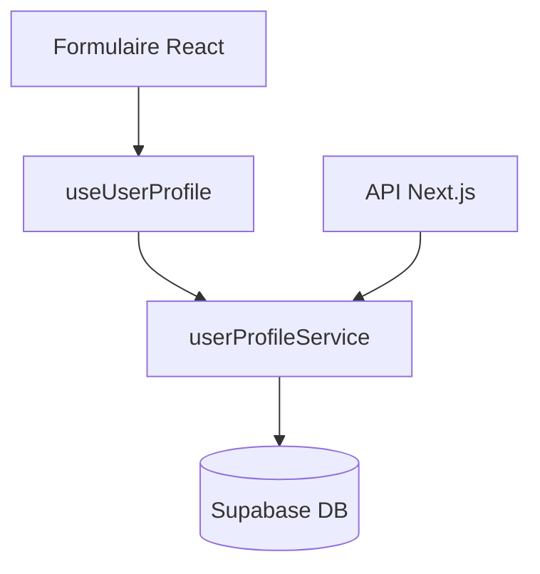

# Module Profils Utilisateurs

[](https://uptimerobot.com/dashboard#<YOUR_MONITOR_ID>)
[](https://github.com/<owner>/<repo>/actions/workflows/userProfiles-ci.yml)
[](https://coveralls.io/github/<owner>/<repo>?branch=main)
[](https://snyk.io/test/github/<owner>/<repo>)

## Description
Gestion centralisée des profils utilisateurs : édition, rôles (admin/opérateur/client), intégration Supabase, UI réutilisable, API REST, hooks React.

## Arborescence
```
src/modules/userProfiles/
  ├── api/
  ├── components/
  ├── hooks/
  ├── services/
  ├── types/
  ├── __tests__/
  └── README.md
```

## Diagramme (schéma simplifié)



## Exemple d’utilisation (React)
```tsx
import { useUserProfile } from './hooks/useUserProfile';
import { UserProfileForm } from './components/UserProfileForm';

const { profile, loading, save } = useUserProfile(userId);
return profile && (
  <UserProfileForm profile={profile} onChange={save} onSave={() => save(profile)} loading={loading} />
);
```

## Exemple avancé : intégration dashboard
```tsx
import { useUserProfile } from 'src/modules/userProfiles/hooks/useUserProfile';
import { UserProfileForm } from 'src/modules/userProfiles/components/UserProfileForm';

export function DashboardProfile({ userId }: { userId: string }) {
  const { profile, loading, save } = useUserProfile(userId);
  if (!profile) return <span>Chargement…</span>;
  return (
    <section>
      <h2>Profil utilisateur</h2>
      <UserProfileForm profile={profile} onChange={save} onSave={() => save(profile)} loading={loading} />
    </section>
  );
}
```

## Installation & configuration
- Variables d’environnement : SUPABASE_URL, SUPABASE_ANON_KEY
- Dépendances : @supabase/supabase-js
- Table users Supabase avec colonnes : id, email, fullName, role, avatarUrl, preferences, created_at, updated_at

## Scripts
- `npm run test` : tests unitaires (Vitest)
- `npm run test:e2e` : tests E2E (Cypress)
- `npm run docs` : génération documentation TypeDoc

## Badges
- Build, coverage, sécurité (à ajouter après CI)

## Guide API
- GET `/api/userProfiles?userId=...` : profil unique
- GET `/api/userProfiles` : liste profils
- PUT `/api/userProfiles` : mise à jour

## Licence
MIT

---

## Monitoring & Alertes

---

## Publication npm

Pour publier une nouvelle version du module :

1. Mettez à jour le champ `version` dans `src/modules/userProfiles/package.json`.  
2. Créez un tag correspondant, ex :
   ```bash
   git tag user-profiles-v1.0.0
   git push origin user-profiles-v1.0.0
   ```
3. Le workflow GitHub Actions `Publish User Profiles Module` s’exécutera et publiera automatiquement `@your-org/user-profiles` sur npm.

> **Note:** Assurez-vous d’avoir configuré le secret `NPM_TOKEN` dans les Settings du dépôt.

---

# Web UI – Charte graphique & intégration

## Palette de couleurs

| Rôle          | Couleur   | Usage principal                                     |
|---------------|-----------|----------------------------------------------------|
| Primaire      | #1A3C40   | Bleu pétrole foncé — header, boutons principaux, fonds clés, base UI fiable |
| Secondaire    | #F9A825   | Jaune-or — icônes, bandeaux, titres, notifications |
| Accent CTA    | #E65100   | Orange profond — boutons CTA, hover, badges        |
| Tertiaire Fresh | #009688 | Vert sarcelle — fonds secondaires, badges, pictos |
| Texte principal | #263238  | Gris bleuté foncé — textes courants                 |
| Fond clair    | #F4F4F4   | Fonds généraux et zones neutres                      |

## Typographies
- Titres : Montserrat (Google Fonts)
- Texte courant : Open Sans (Google Fonts)

## Intégration

1. Importer `styles/globals.css` dans `_app.tsx`.
2. Utiliser les variables CSS définies dans `styles/variables.css`.
3. Utiliser le composant `Button` pour les boutons avec les variantes `primary`, `secondary` ou `accent`.
4. Utiliser le composant `Layout` pour structurer les pages.

---

## 🔬 Tests & Documentation UI

[](https://github.com/<owner>/<repo>/actions/workflows/userProfiles-ci.yml)
[](https://coveralls.io/github/<owner>/<repo>?branch=main)
<!-- [](http://localhost:6006) -->

📄 [Documentation complète Storybook & Tests UI](./storybook-tests.md)

---

## Prochaines améliorations possibles
- Ajouter Storybook pour visualiser les composants UI.
- Ajouter tests visuels et unitaires pour la cohérence.
- Étendre la charte à d’autres composants (Alertes, Badges, Cards).

---

1. **UptimeRobot**  
   - Configure un monitor HTTP(s) pointant vers l’endpoint API Profils (ex: `https://<TON_DOMAINE>/api/userProfiles`).  
   - Récupère ta **API Key** et ton **Monitor ID**, puis ajoute le badge suivant en haut du README :

   ```md
   [](https://uptimerobot.com/dashboard#<YOUR_MONITOR_ID>)
   ```

2. **Alertes Slack**

   - Crée un **Incoming Webhook** dans Slack et ajoute l’URL dans les **Secrets** GitHub (`SLACK_WEBHOOK_URL`).
   - Le workflow [`notify-on-failure.yml`](../../../../.github/workflows/notify-on-failure.yml) s’exécute après chaque build CI `Profils Utilisateurs CI` :
     - En cas d’échec (`conclusion != success`), un message est envoyé dans Slack.
   - Exemple de message :

     > 🚨 *Profils Utilisateurs CI* a échoué sur la branche `main`.
     > Commit: `abc123` par @utilisateur.
     > [Voir les logs complète](lien vers l’exécution)
